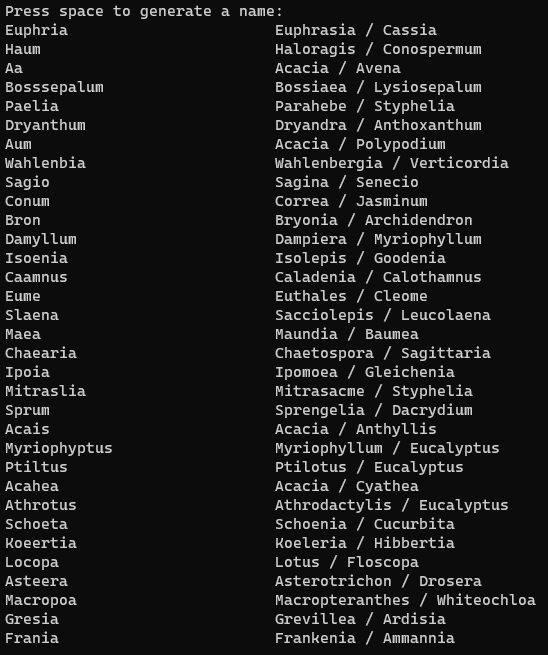
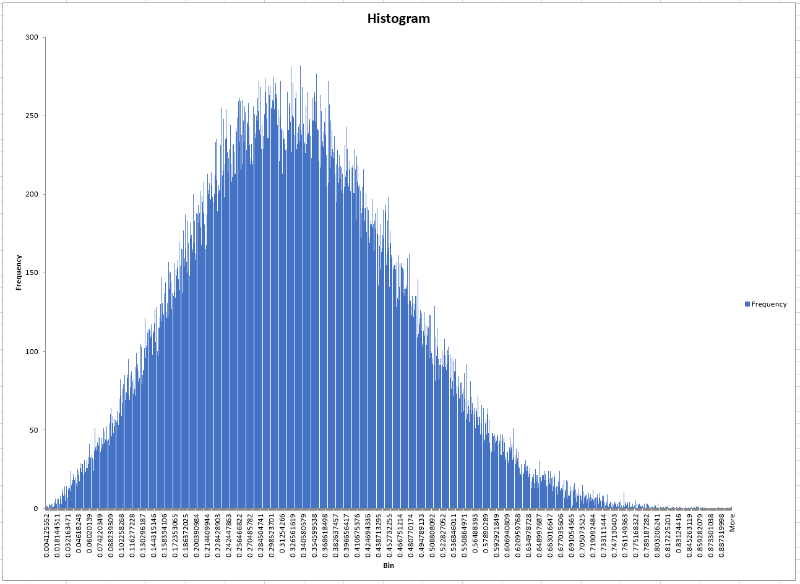

# Name Combiner from Aussie Flora and Fauna
Generate random names from the names of A
Aussie flora and fauna.

**Example**



### Scrape new name data
```
npm run scrape
```

### Generate names
```
npm run generate
```

Press spacebar to generate names, press any other key to quit.
Generated name is shown on the left, constituent names on the right.

The generation currently takes the first N characters of one name, then the last N characters of the second name. This random number of characters is between 1 and the length of the name, with a slight skew toward 1 to prevent generation of very long names.

### Test random distribution
```
npm run testrand
```

This script generates random numbers in a normal-ish distribution, with a slight skew. The numbers are written to a CSV file which can be loaded into Excel or similar to analyse the spread.


